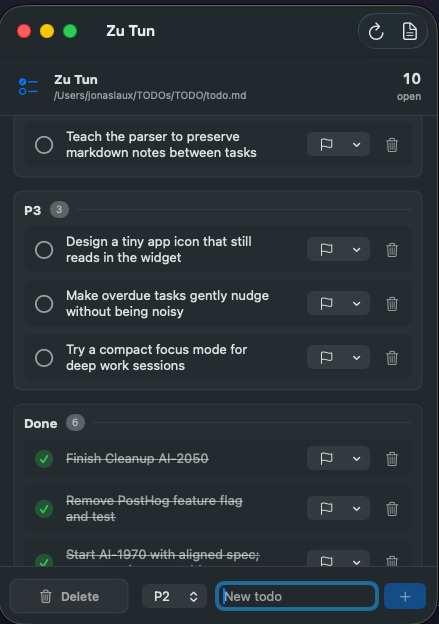
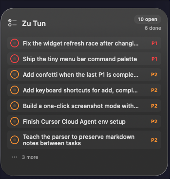

# Zu Tun

Zu Tun is a small macOS todo app backed by a plain `todo.md` file. It gives you a main window, a menu bar popover, and a WidgetKit widget for quickly scanning and checking off tasks.

<p>
  
  
</p>

The app stores todos as Markdown checkboxes:

```md
# Todo

- [ ] (P1) Ship the thing
- [ ] (P2) Follow up
- [x] (P3) Done already
```

## Features

- Reads and writes `todo.md`
- Choose the folder that contains your todo file
- Add, complete, delete, and reprioritize todos
- Menu bar popover for quick edits
- macOS widget with check-off support
- Priority groups for `P1`, `P2`, and `P3`

## Requirements

- macOS 14 or newer
- Xcode
- [XcodeGen](https://github.com/yonaskolb/XcodeGen)

Install XcodeGen with Homebrew:

```sh
brew install xcodegen
```

## Build And Run

```sh
./script/build_and_run.sh
```

The script regenerates `ZuTun.xcodeproj` from `project.yml`, builds the app, installs it into `/Applications` by default, registers the widget extension, and launches the app.

Useful checks:

```sh
swift run ZuTunParserCheck
./script/build_and_run.sh --verify
./script/build_and_run.sh --verify-widget
```

## Agent Skill

A Codex-compatible agent skill lives at `skills/zu-tun/SKILL.md`. It documents the todo format, safe edit workflow, and local verification commands for agents working with Zu Tun.

## Signing

This repo is configured for my personal bundle identifier and app group. To build under your own Apple Developer account, update:

- `DEVELOPMENT_TEAM` and bundle identifiers in `project.yml`
- the app group identifier in `Entitlements/*.entitlements`
- `TodoLocation.appGroupIdentifier` in `Sources/ZuTunCore/Models/TodoLocation.swift`
- `BUNDLE_ID` in `script/build_and_run.sh`

Then run `./script/build_and_run.sh` again.

## Notes

`ZuTun.xcodeproj` is generated and intentionally not committed. `project.yml` is the source of truth.

The app is a personal utility and is not packaged or notarized for distribution yet.
