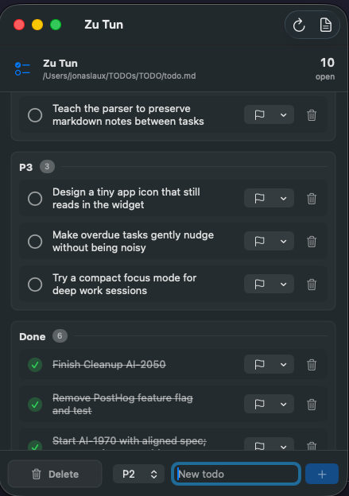
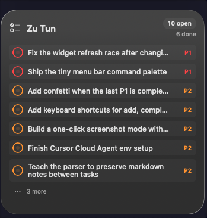

# Zu Tun

Zu Tun is a small macOS todo app backed by a plain `todo.md` file. It gives you a main window, a menu bar popover, and a WidgetKit widget for quickly scanning and checking off tasks.

<p>
  
  
</p>

## Why

I built Zu Tun because I wanted a todo list that agents can update without an API, account, or custom backend. During a morning briefing, an agent can pull action items from meetings, emails, or Slack messages, write them into a plain Markdown file, and make them show up in a small Mac app and widget.

I sync the file through Obsidian, so the workflow stays portable: humans and agents work against the same `todo.md`.

The app stores todos as Markdown checkboxes:

```md
# Todo

- [ ] (P1) Ship the thing
- [ ] (P2) Follow up
- [x] (P3) Done already
```

## Multiline Task Text

Task text can contain visual line breaks while each todo remains one physical
Markdown line. Use `<br>` in the task text; `<br><br>` leaves a blank visual
line. `<br/>` and `<br />` are also accepted, case-insensitively. Inline
Markdown and existing `zutun-id` and `zutun-tags` comments stay attached to
the same task.

The pencil and text-format popovers use Return for a new line and Command-
Return to save or apply. In the quick composer, Option-Return inserts a new
line and Return adds the todo. Normal rows show all explicit lines; widgets
keep their compact display limits. To show a literal `<br>` in task text, use
`&lt;br&gt;`.

## Reusable Tags

Tags live in the same Markdown file. Define each tag once on its own line:

```markdown
<!-- zutun-tag: {"id":"work","name":"Work","color":"#3478F6"} -->
<!-- zutun-tag: {"id":"home","name":"Home","color":"#34A853"} -->

- [ ] (P2) Review the plan <!-- zutun-tags: ["work"] -->
- [x] (P3) Buy supplies <!-- zutun-tags: ["work","home"] -->
```

- IDs are stable, unique strings. The app generates UUIDs; agents may use a
  unique descriptive ID. Reuse existing definitions instead of duplicating tags.
- Names must be nonempty, single-line, and unique ignoring case. Colors use
  `#RRGGBB`. JSON-escape names and IDs; encode `>` as `\u003E`
  inside JSON strings so comment delimiters stay valid. Keep metadata on one line.
- Assign or unassign a tag by changing only the task's trailing ID array.
  Omit the comment when no tags remain. A task may have multiple tags.
- Edit a tag's name or color in its definition, keeping its ID unchanged;
  this updates every use. Do not rename IDs to rename tags.
- Delete a tag by removing its definition AND that ID from every task,
  including completed tasks. Keep other tags and task content intact.
- Preserve unknown IDs and malformed metadata during unrelated edits. Do not
  convert ordinary hashtags in task text into tags.

## Features

- Reads and writes `todo.md`
- Copy an agent prompt for one todo from its share button in the main window or menu bar
- Format task text with **bold**, *italic*, `code`, and named Markdown links
- Use the pencil beside a task to edit it with a live preview; use the text-format button beside New todo to format a draft
- Choose the folder that contains your todo file
- Add, complete, delete, and reprioritize todos
- Reusable tags with names and colors; edit once to update every use
- Tag management and assignment in the main window and menu bar
- Deleting a tag removes it from open and completed todos
- Menu bar popover for quick edits
- macOS widget with check-off support
- Priority groups for `P1`, `P2`, and `P3`

## Share A Todo With An Agent

Click the share icon beside a todo (or right-click it in the main window and choose **Copy for Agent**), then paste into an agent session. The prompt tells the agent to use the global `zu-tun` skill and includes the todo's title, absolute file path, current line number, and stable ID. The agent needs access to that file.

The first copy adds a hidden `<!-- zutun-id: UUID -->` comment to that item. Future copies reuse it. Keep this comment when editing or moving the todo so old prompts still find it after its title or line number changes. Give duplicated tasks their own ID; copying an ambiguous ID reports an error. Line numbers are only a hint, since adding or moving todos changes them.

## Requirements

- macOS 14 or newer
- Xcode
- [XcodeGen](https://github.com/yonaskolb/XcodeGen)

Install XcodeGen with Homebrew:

```sh
brew install xcodegen
```

## Build And Run

```sh
./script/build_and_run.sh
```

The script regenerates `ZuTun.xcodeproj` from `project.yml`, builds the app, installs it into `/Applications` by default, registers the widget extension, and launches the app.

Useful checks:

```sh
swift run ZuTunParserCheck
./script/build_and_run.sh --verify
./script/build_and_run.sh --verify-widget
```

## Agent Skill

A Codex-compatible agent skill lives at `skills/zu-tun/SKILL.md`. It documents the todo format, safe edit workflow, and local verification commands for agents working with Zu Tun.

## Signing

This repo is configured for my personal bundle identifier and app group. To build under your own Apple Developer account, update:

- `DEVELOPMENT_TEAM` and bundle identifiers in `project.yml`
- the app group identifier in `Entitlements/*.entitlements`
- `TodoLocation.appGroupIdentifier` in `Sources/ZuTunCore/Models/TodoLocation.swift`
- `BUNDLE_ID` in `script/build_and_run.sh`

Then run `./script/build_and_run.sh` again.

## Notes

`ZuTun.xcodeproj` is generated and intentionally not committed. `project.yml` is the source of truth.

The app is a personal utility and is not packaged or notarized for distribution yet.
